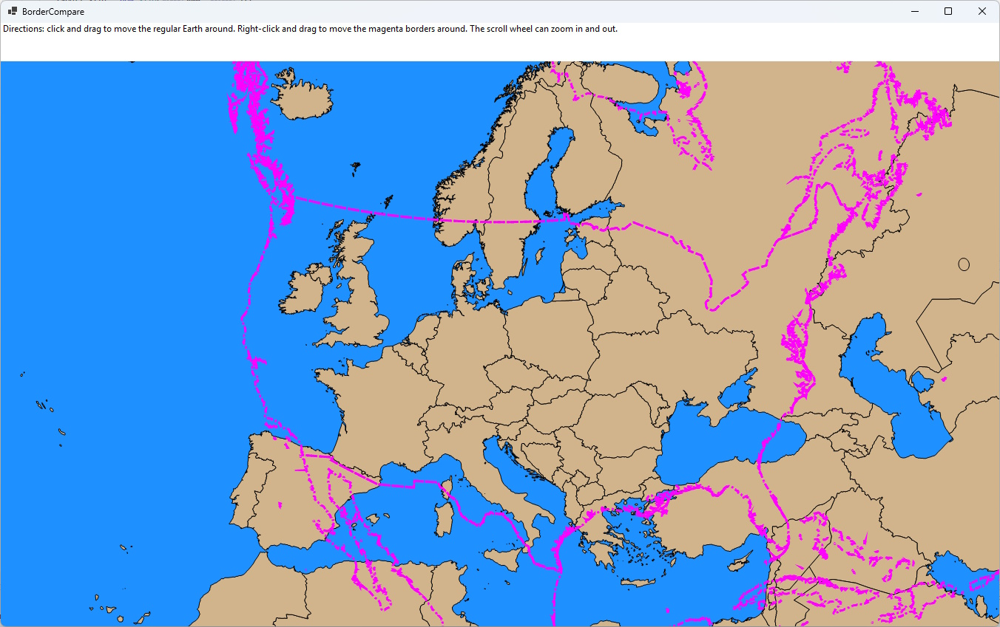
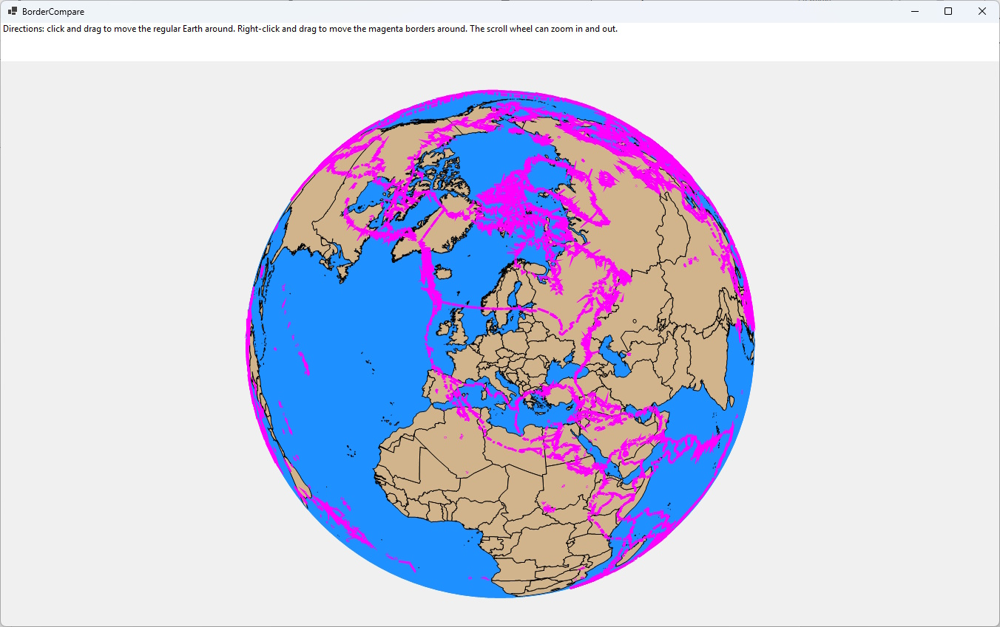

BorderCompare is a WinForms app using dotnet8. It allows you to overlay any country's borders over any other part of the world while preserving scale. Unlike similar approaches out there, this uses a projection that preserves scale even round the poles.

